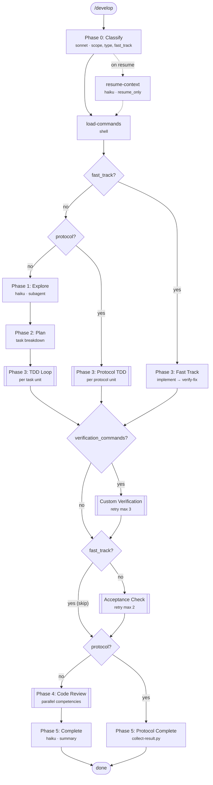
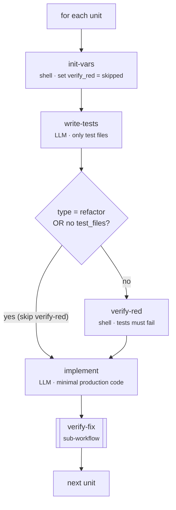
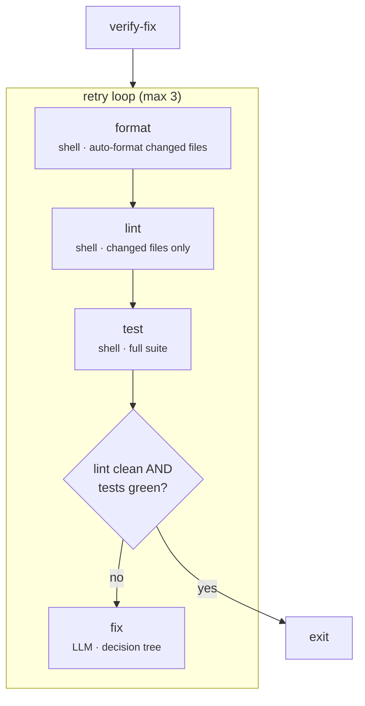
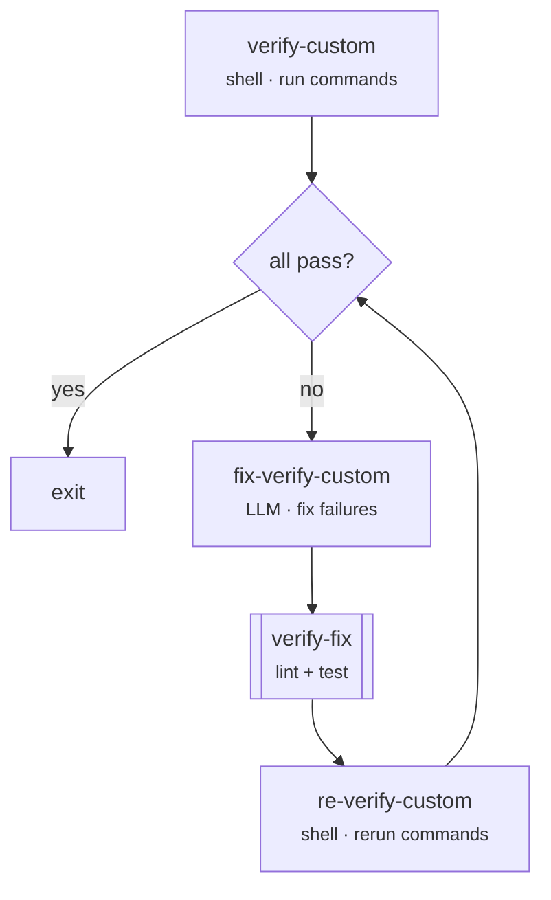
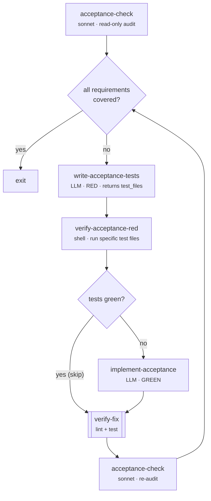

# Development Workflow Architecture

The `/develop` workflow implements a TDD-driven development process with automated verification gates. It supports three execution modes: **normal**, **fast-track** (trivial changes), and **protocol** (orchestrated multi-step work).

## Overview

## Phases

| Phase | Block                                             | Model            | Skip when                  |
| ----- | ------------------------------------------------- | ---------------- | -------------------------- |
| 0     | `classify`                                        | sonnet           | never                      |
| 0r    | `resume-context`                                  | haiku            | fresh run (only on resume) |
| 1     | `explore`                                         | haiku (subagent) | fast_track, protocol       |
| 2     | `plan`                                            | default          | fast_track, protocol       |
| 3     | `implement` / `protocol-implement` / `fast-track` | default          | (mode-dependent)           |
| —     | `verify-custom` + retry                           | shell + default  | no verification_commands   |
| —     | `acceptance-check` + retry                        | sonnet           | fast_track                 |
| 4     | `review` (code-review sub-workflow)               | parallel         | protocol                   |
| 5     | `complete` / `protocol-complete`                  | haiku / shell    | (mode-dependent)           |

---

## TDD Loop (detail)

The workflow iterates over task units from the plan (normal mode) or `variables.units` (protocol mode). Each unit goes through a full RED→GREEN cycle:

**write-tests (RED)** — writes failing tests that define expected behavior before any production code:

- Bug fixes: test that reproduces the bug
- Features: tests for the expected API/behavior
- Refactors: verifies existing coverage, adds tests only for gaps

**verify-red** — runs only the unit's test files via `dev-tools.py test --scope specific`. Confirms tests actually fail, catching always-pass assertions. Skipped for refactors (no behavior change) and when no test files are specified.

**implement (GREEN)** — writes minimal production code to make tests pass. Receives `verify_red` output to guide implementation. May fix mechanical test errors (import typos, missing fixtures) but must not change assertion logic.

---

## verify-fix (detail)

Reusable sub-workflow that runs after every implementation step. Retry loop with max 3 attempts:

- **format** runs first to avoid LLM wasting tokens on formatting
- **lint** scoped to changed files, **test** runs the full suite (catches regressions)
- **fix** LLM receives both lint and test output, uses a decision tree:
    - Mechanical test error (crash before assertion) → fix the test
    - Assertion failure matching task objective → fix production code
    - Assertion failure contradicting task objective → fix the test
- Loop exits early if lint clean + tests green (fix step skipped)

Injects `workdir` and `scope` (backend/frontend/fullstack) to target the right toolchain.

**Used in 4 places**: after TDD implement (`green-loop`), after fast-track (`fast-verify`), inside verify-custom-retry, inside acceptance-retry.

---

## Custom Verification (detail)

Protocol-specific commands (type-check, build, etc.) run after TDD/fast-track completes. Only active when `verification_commands` is set.

Retry max 3 attempts. The LLM fixes code/config to satisfy failing commands without weakening or removing verification commands (they are acceptance criteria).

---

## Acceptance Check (detail)

After all implementation and verification passes, a sonnet LLM audits the diff against the original task requirements. Skipped for fast-track.

Retry max 2 attempts. The audit checks each requirement for both implementation and test coverage. The `implement-acceptance` step is skipped when tests already pass (test-only gap: implementation exists but tests were missing).

---

## Verification Gates

Three layers, each catching different problem classes:

| Gate                 | Type              | Runs after                | Catches                                 | Retry |
| -------------------- | ----------------- | ------------------------- | --------------------------------------- | ----- |
| **verify-fix**       | lint + test       | every implementation step | syntax, lint, regressions               | 3x    |
| **verify-custom**    | protocol commands | TDD/fast-track            | build, type errors, project checks      | 3x    |
| **acceptance-check** | requirement audit | verify-custom             | missing requirements, untested behavior | 2x    |

All three must pass for `protocol-complete` to report `passed: true`.

## Output Schemas

| Schema                  | Used by                | Fields                                                               |
| ----------------------- | ---------------------- | -------------------------------------------------------------------- |
| `ClassifyOutput`        | classify               | scope, type, complexity, fast_track, relevant_guides                 |
| `ExploreOutput`         | explore                | files_to_modify, reference_files, existing_tests, patterns, findings |
| `PlanOutput`            | plan                   | tasks (list of PlanTask), findings                                   |
| `AcceptanceOutput`      | acceptance-check       | requirements, covered, missing, out_of_scope, passed                 |
| `AcceptanceTestsOutput` | write-acceptance-tests | test_files                                                           |
| `DevelopResult`         | complete               | summary, files_changed, findings                                     |

## Key Files

| File                | Purpose                                            |
| ------------------- | -------------------------------------------------- |
| `workflow.py`       | Workflow definition (blocks, schemas, conditions)  |
| `dev-tools.py`      | Shell tool for lint, test, format, verify commands |
| `collect-result.py` | Protocol-mode result aggregation                   |
| `prompts/`          | LLM prompt templates per step                      |
