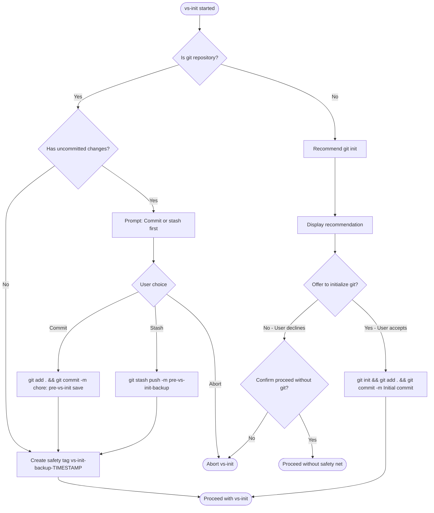
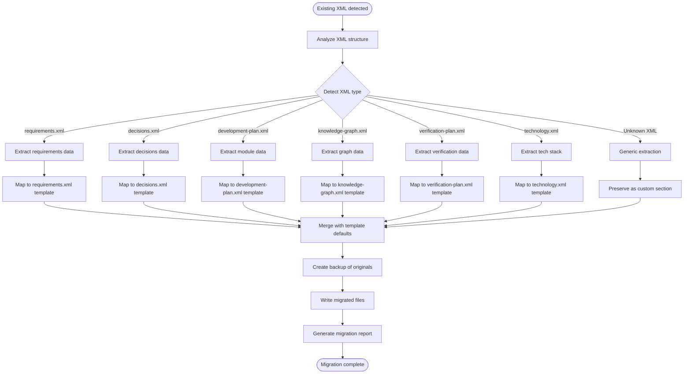

# vs-init Safety Improvements Design

**Version:** 1.0  
**Date:** 2026-03-25  
**Author:** Architect Mode  
**Status:** Draft for Review

---

## Executive Summary

This document designs two critical safety improvements for the vs-init skill:

1. **Git Checkpoint Safety Mechanism** - Ensures users can rollback if initialization goes wrong
2. **XML Migration/Mapping Strategy** - Preserves valuable project context when migrating existing XML files

Both improvements focus on **safety first** and **data preservation**.

---

## Improvement 1: Git Checkpoint Safety Mechanism

### Problem Statement

The current vs-init skill makes changes to project files without verifying git state. If something goes wrong during initialization:

- Users cannot easily rollback to pre-init state
- Uncommitted work might be mixed with vs-init changes
- No safety net exists for recovery

### Proposed Solution

Add a pre-initialization git safety check that:
1. Detects if the project is a git repository
2. For git projects: ensures clean state and creates a safety checkpoint
3. For non-git projects: recommends git initialization with optional assistance

### Decision Flow Diagram



### User Prompt Examples

#### Scenario A: Git Repository with Uncommitted Changes

```
╔═══════════════════════════════════════════════════════════════════════════╗
║                    UNCOMMITTED CHANGES DETECTED                           ║
╠═══════════════════════════════════════════════════════════════════════════╣
║                                                                            ║
║  Your project has uncommitted changes that should be saved before          ║
║  vs-init modifies any files.                                               ║
║                                                                            ║
║  Changed files:                                                            ║
║    • src/main.ts (modified)                                                ║
║    • docs/README.md (modified)                                             ║
║    • config.json (new file)                                                ║
║                                                                            ║
║  Options:                                                                  ║
║    [1] Commit changes now                                                  ║
║        → git add . && git commit -m "chore: pre-vs-init save"             ║
║        → Then create safety tag and proceed                                ║
║                                                                            ║
║    [2] Stash changes temporarily                                           ║
║        → git stash push -m "pre-vs-init-backup"                           ║
║        → You can restore later with git stash pop                          ║
║                                                                            ║
║    [3] Abort vs-init                                                       ║
║        → Manually commit/stash your changes, then run vs-init again        ║
║                                                                            ║
╚═══════════════════════════════════════════════════════════════════════════╝

Your choice [1/2/3]:
```

#### Scenario B: No Git Repository

```
╔═══════════════════════════════════════════════════════════════════════════╗
║                    NO GIT REPOSITORY DETECTED                             ║
╠═══════════════════════════════════════════════════════════════════════════╣
║                                                                            ║
║  This project is not under version control.                                ║
║                                                                            ║
║  ⚠️  WARNING: Without git, you cannot rollback if vs-init causes issues.  ║
║                                                                            ║
║  Strong recommendation: Initialize git first for safety.                   ║
║                                                                            ║
║  Options:                                                                  ║
║    [1] Initialize git and create initial commit (RECOMMENDED)              ║
║        → git init                                                          ║
║        → git add .                                                         ║
║        → git commit -m "chore: initial commit before vs-init"             ║
║        → Then proceed with vs-init                                         ║
║                                                                            ║
║    [2] Proceed without git                                                 ║
║        → Continue at your own risk                                         ║
║        → No rollback capability                                            ║
║                                                                            ║
║    [3] Abort vs-init                                                       ║
║        → Manually set up git, then run vs-init again                       ║
║                                                                            ║
╚═══════════════════════════════════════════════════════════════════════════╝

Your choice [1/2/3]:
```

#### Scenario C: Clean Git Repository - Creating Safety Tag

```
╔═══════════════════════════════════════════════════════════════════════════╗
║                    CREATING SAFETY CHECKPOINT                             ║
╠═══════════════════════════════════════════════════════════════════════════╣
║                                                                            ║
║  ✓ Working directory is clean                                              ║
║                                                                            ║
║  Creating safety tag: vs-init-backup-20260325-172500                       ║
║    → git tag -a vs-init-backup-20260325-172500 -m "vs-init checkpoint"    ║
║                                                                            ║
║  If something goes wrong, rollback with:                                   ║
║    git checkout vs-init-backup-20260325-172500                             ║
║                                                                            ║
╚═══════════════════════════════════════════════════════════════════════════╝
```

### Edge Cases Handled

| Edge Case | Detection | Resolution |
|-----------|-----------|------------|
| Git repository but detached HEAD | `git symbolic-ref -q HEAD` fails | Prompt user to checkout a branch first |
| Git repository with merge conflicts | `git ls-files -u` not empty | Require user to resolve conflicts before proceeding |
| Git repository with staged but uncommitted | `git diff --cached` not empty | Include in uncommitted changes prompt |
| Submodule directory | `.git` file exists | Check submodule status, same rules apply |
| Bare repository | `git rev-parse --is-bare-repository` = true | Skip vs-init, not applicable |
| Git init fails | Command returns non-zero | Abort with error message |
| Tag creation fails | Command returns non-zero | Warn user, proceed without tag |

### Safety Tag Naming Convention

```
vs-init-backup-YYYYMMDD-HHMMSS
```

Example: `vs-init-backup-20260325-172500`

### Implementation Steps

1. **Step 0.1: Git Detection**
   ```
   [SKILL:vs-init] Step 0.1: Checking git status...
   
   Git status:
     • Repository: [yes/no]
     • Clean working directory: [yes/no]
     • Current branch: [branch-name]
   ```

2. **Step 0.2: Handle Git State**
   - If no git: offer initialization
   - If dirty: prompt for commit/stash
   - If clean: create safety tag

3. **Step 0.3: Confirm Safety Checkpoint**
   ```
   [SKILL:vs-init] Step 0.3: Safety checkpoint created
   
   Safety tag: vs-init-backup-20260325-172500
   Rollback command: git checkout vs-init-backup-20260325-172500
   ```

---

## Improvement 2: XML Migration/Mapping Strategy

### Problem Statement

When vs-init encounters existing XML files in `docs/`, the current approach:
1. Creates a backup in `docs/.backup/`
2. Overwrites with fresh template content
3. **Loses all existing project context**

This is problematic because:
- Requirements gathered over time are discarded
- Architecture decisions are lost
- Module structure knowledge disappears
- Semantic markup and cross-references vanish

### Proposed Solution

Implement intelligent XML migration that:
1. Analyzes existing XML files for GRACE-compatible structure
2. Extracts valuable data using pattern matching
3. Maps extracted data to new template structure
4. Generates a migration report showing what was preserved

### Migration Workflow



### Data Extraction Rules

#### requirements.xml Extraction

| Source Pattern | Target Element | Migration Rule |
|----------------|----------------|----------------|
| `<UseCases>/<UC-*>` | `<UseCases>/<UC-*>` | Copy entire element, preserve ID |
| `<Decisions>/<D-*>` | `<Decisions>/<D-*>` | Copy to requirements.xml Decisions section |
| `<Constraints>/*` | `<Constraints>/*` | Copy all constraint sections |
| `<Glossary>/<term>` | `<Glossary>/<term>` | Copy all term definitions |
| `<ProjectInfo>` | `<ProjectInfo>` | Merge with new project info |

**Extraction Algorithm:**
```
for each child of root element:
    if child matches known GRACE structure:
        extract to corresponding section
    else if child has ID attribute:
        extract as custom section with warning
    else:
        preserve in <LegacyData> section
```

#### decisions.xml Extraction

| Source Pattern | Target Element | Migration Rule |
|----------------|----------------|----------------|
| `<Decisions>/<D-*>` | `<Decisions>/<D-*>` | Copy entire element with all children |
| `<Categories>/*` | `<Categories>/*` | Merge with template categories |
| `<Statistics>` | `<Statistics>` | Recalculate after migration |

**Special Handling:**
- Preserve all `<review>` sections
- Update `<links>` if document structure changed
- Recalculate `<Statistics>` based on migrated decisions

#### development-plan.xml Extraction

| Source Pattern | Target Element | Migration Rule |
|----------------|----------------|----------------|
| `<Modules>/<M-*>` | `<Modules>/<M-*>` | Copy with full contract definition |
| `<DataFlow>/<DF-*>` | `<DataFlow>/<DF-*>` | Copy entire flow definition |
| `<ImplementationOrder>/*` | `<ImplementationOrder>/*` | Preserve phases and steps |
| `<ArchitectureNotes>/*` | `<ArchitectureNotes>/*` | Copy all notes |

**Module Migration:**
- Preserve `<contract>` definitions completely
- Keep `<target>` paths if files still exist
- Update `<verification-ref>` if verification plan changed

#### knowledge-graph.xml Extraction

| Source Pattern | Target Element | Migration Rule |
|----------------|----------------|----------------|
| `<Nodes>/<M-*>` | `<Nodes>/<M-*>` | Copy node with all metadata |
| `<Edges>/<edge>` | `<Edges>/<edge>` | Copy all edges, validate references |
| `<CrossLinks>/*` | `<CrossLinks>/*` | Copy and update document references |
| `<Layers>/*` | `<Layers>/*` | Recalculate after node migration |

**Graph Integrity:**
- Validate all edge references exist in nodes
- Remove orphaned edges with warning
- Recalculate layer assignments

### Migration Report Format

```xml
<?xml version="1.0" encoding="UTF-8"?>
<MigrationReport TIMESTAMP="2026-03-25T17:25:00Z">
  
  <Summary>
    <source-files>3</source-files>
    <extracted-elements>27</extracted-elements>
    <preserved-elements>24</preserved-elements>
    <warnings>3</warnings>
    <errors>0</errors>
  </Summary>
  
  <FileMigrations>
    <File name="requirements.xml">
      <status>migrated</status>
      <backup>docs/.backup/requirements.xml.20260325-172500</backup>
      <extracted>
        <element type="UseCase" id="UC-001" action="preserved" />
        <element type="UseCase" id="UC-002" action="preserved" />
        <element type="Decision" id="D-001" action="preserved" />
        <element type="Constraint" id="technical/constraint-1" action="preserved" />
      </extracted>
      <warnings>
        <warning>Unknown element <customData> moved to LegacyData section</warning>
      </warnings>
    </File>
    
    <File name="decisions.xml">
      <status>migrated</status>
      <backup>docs/.backup/decisions.xml.20260325-172500</backup>
      <extracted>
        <element type="Decision" id="D-001" action="preserved" />
        <element type="Decision" id="D-002" action="preserved" />
        <element type="Decision" id="D-003" action="preserved" />
      </extracted>
    </File>
    
    <File name="development-plan.xml">
      <status>migrated</status>
      <backup>docs/.backup/development-plan.xml.20260325-172500</backup>
      <extracted>
        <element type="Module" id="M-CONFIG" action="preserved" />
        <element type="Module" id="M-DB" action="preserved" />
        <element type="DataFlow" id="DF-001" action="preserved" />
      </extracted>
      <warnings>
        <warning>Module M-DEPRECATED references non-existent module, edge removed</warning>
      </warnings>
    </File>
  </FileMigrations>
  
  <PreservationMap>
    <!-- Maps old IDs to new IDs if renumbering occurred -->
    <mapping old="UC-001" new="UC-001" />
    <mapping old="D-001" new="D-001" />
  </PreservationMap>
  
  <RollbackInstructions>
    <step-1>To rollback: cp docs/.backup/*.xml.20260325-172500 docs/</step-1>
    <step-2>Or use git: git checkout vs-init-backup-20260325-172500 -- docs/</step-2>
  </RollbackInstructions>
  
</MigrationReport>
```

### User Prompts for Migration

#### When Existing XML Detected

```
╔═══════════════════════════════════════════════════════════════════════════╗
║                    EXISTING XML FILES DETECTED                            ║
╠═══════════════════════════════════════════════════════════════════════════╣
║                                                                            ║
║  Found existing GRACE-compatible XML files:                                ║
║                                                                            ║
║    • docs/requirements.xml (2 use cases, 1 decision, 4 constraints)       ║
║    • docs/decisions.xml (3 decisions)                                      ║
║    • docs/development-plan.xml (5 modules, 2 data flows)                   ║
║                                                                            ║
║  Options:                                                                  ║
║    [1] Migrate existing data (RECOMMENDED)                                 ║
║        → Extract valuable data from existing files                         ║
║        → Merge with new template structure                                 ║
║        → Create backups of originals                                       ║
║        → Generate migration report                                         ║
║                                                                            ║
║    [2] Fresh start - replace all                                           ║
║        → Backup existing files                                             ║
║        → Create fresh from templates                                       ║
║        → ⚠️ All existing data will be lost                                ║
║                                                                            ║
║    [3] Keep existing - skip XML creation                                   ║
║        → Leave existing XML files unchanged                                ║
║        → Only create missing files                                         ║
║                                                                            ║
╚═══════════════════════════════════════════════════════════════════════════╝

Your choice [1/2/3]:
```

#### Migration Preview

```
╔═══════════════════════════════════════════════════════════════════════════╗
║                    MIGRATION PREVIEW                                      ║
╠═══════════════════════════════════════════════════════════════════════════╣
║                                                                            ║
║  The following data will be preserved:                                     ║
║                                                                            ║
║  From requirements.xml:                                                    ║
║    ✓ UC-001: Initialize vibestart in user project                         ║
║    ✓ UC-002: Initialize GRACE in user project                             ║
║    ✓ D-001: Remove vs-status, vs-refresh, vs-render commands              ║
║    ✓ 4 technical constraints                                               ║
║    ✓ 2 business constraints                                                ║
║    ✓ Glossary with 6 terms                                                 ║
║                                                                            ║
║  From decisions.xml:                                                       ║
║    ✓ D-001: Remove vs-status, vs-refresh, vs-render commands              ║
║    ✓ D-002: Clone vibestart into .vibestart/ subfolder                    ║
║    ✓ D-003: Initialize GRACE for vibestart itself                         ║
║                                                                            ║
║  From development-plan.xml:                                                ║
║    ✓ M-CONFIG: Configuration module                                        ║
║    ✓ M-DB: Database layer                                                  ║
║    ✓ M-API: API endpoints                                                  ║
║    ✓ DF-001: User authentication flow                                      ║
║    ✓ DF-002: Data synchronization flow                                     ║
║                                                                            ║
║  Warnings:                                                                 ║
║    ⚠ Unknown element <customMetadata> will be moved to LegacyData         ║
║    ⚠ Module M-DEPRECATED has no source file, will be marked inactive      ║
║                                                                            ║
╚═══════════════════════════════════════════════════════════════════════════╝

Proceed with migration? [Y/n]:
```

### Edge Cases Handled

| Edge Case | Detection | Resolution |
|-----------|-----------|------------|
| Malformed XML | XML parsing fails | Abort migration, offer fresh start |
| Unknown root element | Root not in known types | Treat as generic XML, extract text content |
| Missing required attributes | ID attribute missing | Generate new ID with prefix `MIGRATED-` |
| Duplicate IDs across files | Same ID in multiple files | Prefix with file type: `REQ-UC-001` |
| Circular references in graph | Graph traversal detects cycle | Break cycle, add warning to report |
| External file references | `<ref doc="...">` to missing file | Remove reference, add warning |
| Binary content in XML | Base64 or CDATA detected | Preserve as-is in LegacyData |
| Very large files | File > 1MB | Warn user, offer partial migration |
| Non-UTF-8 encoding | Encoding declaration check | Convert to UTF-8, log conversion |

### Implementation Steps

1. **Step 0.4: Detect Existing XML**
   ```
   [SKILL:vs-init] Step 0.4: Scanning for existing XML files...
   
   Existing XML files:
     • docs/requirements.xml - GRACE-compatible ✓
     • docs/decisions.xml - GRACE-compatible ✓
     • docs/custom-config.xml - Unknown format ⚠
   ```

2. **Step 0.5: Analyze and Prompt**
   - Parse each XML file
   - Count extractable elements
   - Present migration options

3. **Step 0.6: Execute Migration**
   - Extract data from source files
   - Merge with template defaults
   - Create backups with timestamp
   - Write migrated files

4. **Step 0.7: Generate Report**
   - Write `docs/.backup/migration-report-TIMESTAMP.xml`
   - Display summary to user
   - Provide rollback instructions

---

## Integration with Existing vs-init Flow

### Updated Step Sequence

The current vs-init flow has 3 steps. With safety improvements:

| Step | Current | With Improvements |
|------|---------|-------------------|
| 0.1 | - | Git detection |
| 0.2 | - | Git state handling |
| 0.3 | - | Safety tag creation |
| 0.4 | - | XML detection |
| 0.5 | - | Migration analysis |
| 0.6 | - | Migration execution |
| 0.7 | - | Migration report |
| 1.x | Detect Environment | Detect Environment (unchanged) |
| 2.x | Create Files | Create Files (with migration support) |
| 3.x | Verify & Report | Verify & Report (enhanced) |

### Modified Quick Reference

| Scenario | Current Action | Enhanced Action |
|----------|----------------|-----------------|
| New project, no git | Create files | Offer git init, then create files |
| New project, clean git | Create files | Create safety tag, then create files |
| Dirty git | Create files | Prompt commit/stash first |
| Existing XML | Backup and replace | Migrate data with report |
| Partial GRACE | Create missing | Migrate existing + create missing |

---

## Configuration Options

New options in `vs.project.toml`:

```toml
[init]
# Git safety settings
git_required = false          # If true, abort if no git repository
auto_create_tag = true        # Automatically create safety tag
tag_prefix = "vs-init-backup" # Prefix for safety tags

# Migration settings  
migration_mode = "migrate"    # "migrate" | "replace" | "keep"
backup_retention = 5          # Number of backups to keep
generate_report = true        # Create migration report
```

---

## Testing Considerations

### Test Scenarios for Git Safety

1. **Clean git repository** → Should create tag and proceed
2. **Dirty git with modified files** → Should prompt for commit/stash
3. **Dirty git with staged files** → Should detect and include in prompt
4. **No git repository** → Should offer git init
5. **Detached HEAD state** → Should warn and require branch checkout
6. **Merge conflict state** → Should abort with resolution instructions
7. **Tag creation failure** → Should warn but proceed

### Test Scenarios for XML Migration

1. **GRACE-compatible requirements.xml** → Should migrate all use cases
2. **GRACE-compatible decisions.xml** → Should preserve all decisions
3. **Partial GRACE structure** → Should migrate what exists
4. **Unknown XML format** → Should extract to LegacyData
5. **Malformed XML** → Should abort migration gracefully
6. **Empty XML files** → Should use template defaults
7. **Large XML files** → Should warn and offer partial migration

---

## Summary

### Git Checkpoint Safety Mechanism

- **Purpose:** Enable rollback if vs-init causes problems
- **Approach:** Detect git state, create safety tag before changes
- **User Impact:** Minimal friction for clean projects, guided resolution for dirty state

### XML Migration Strategy

- **Purpose:** Preserve valuable project context during initialization
- **Approach:** Intelligent extraction and mapping to new template structure
- **User Impact:** Existing work preserved, clear migration report

### Key Benefits

1. **Safety First:** Users can always rollback
2. **Data Preservation:** No loss of existing requirements, decisions, or architecture
3. **Transparency:** Clear reports show what was preserved
4. **Flexibility:** Users choose migration strategy
5. **Graceful Degradation:** Works even in edge cases

---

## Next Steps

1. Review this design document
2. Approve or request modifications
3. Switch to Code mode for implementation
4. Update vs-init SKILL.md with new steps
5. Create migration utility functions
6. Add tests for new functionality
